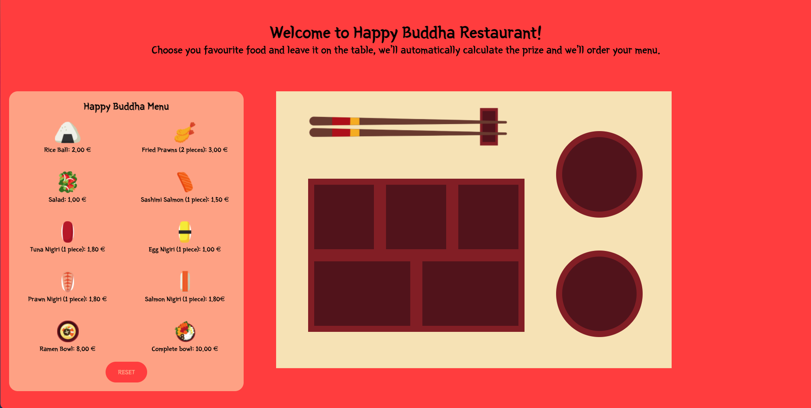
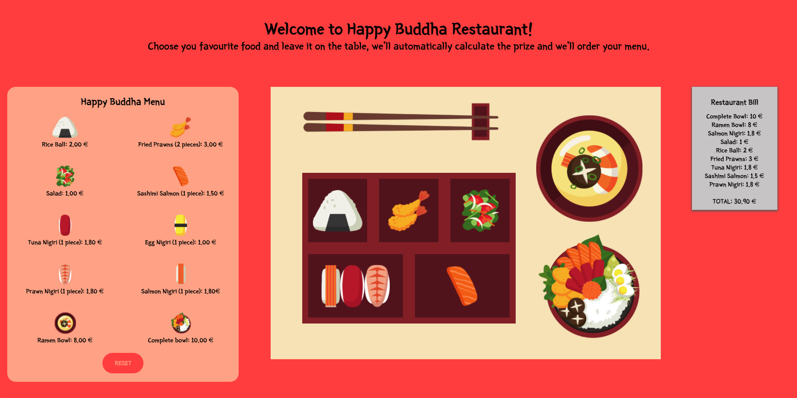

# Happy Buddha Game

Dynamic Showcase created using Html5, Css3 and JavaScript Vainilla.

## Description

You have at your disposal the Happy Buddha's Menu. You are free to choose the food you would like to eat as nigiris, salad or fried prawns. When you drag the food to the tray, the cost will be added to the bill. If you put the reset button, the game will start again.

## Future Improvements

1. Adapt the game to be responsive.
2. Deny bowl food drag to the tray and the sushi food drag to the wood bowls.
